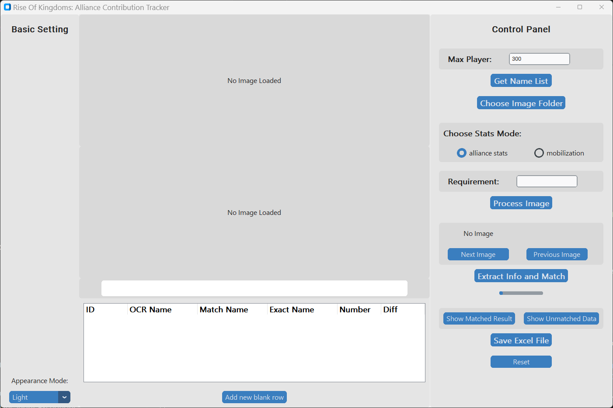
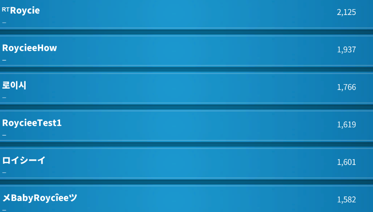
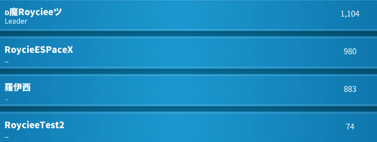
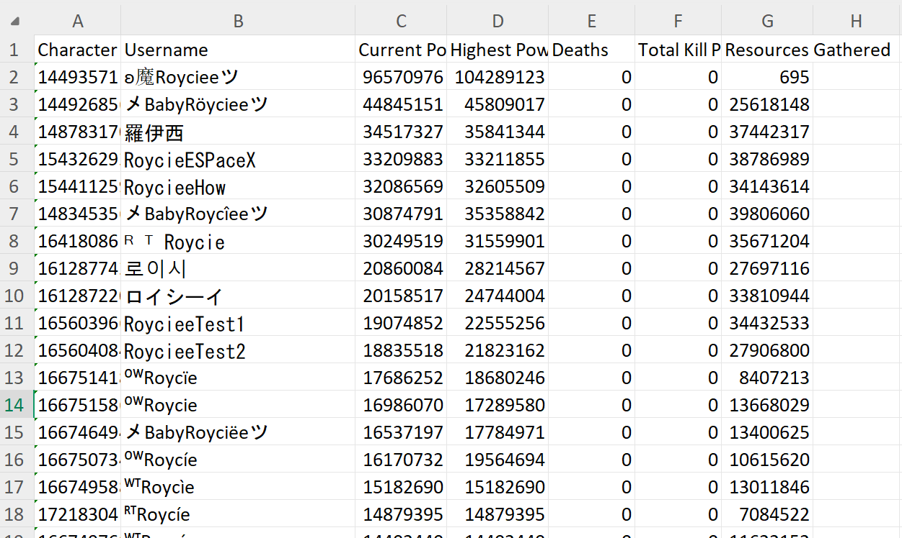
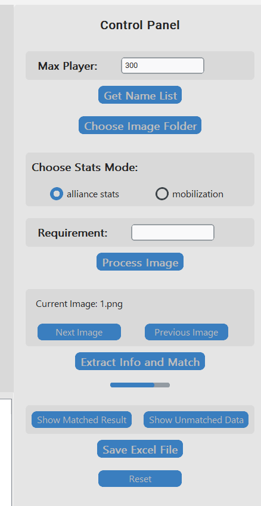
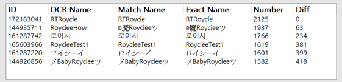
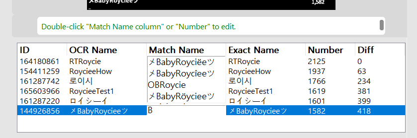
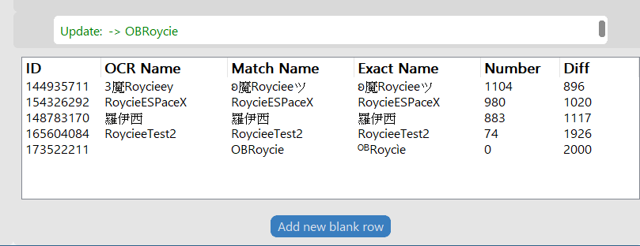
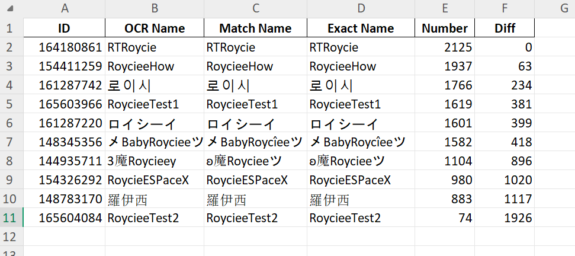

# Rise-Of-Kingdoms-Alliance-Contribution-Tracker

This project uses Python + Tesseract OCR to process Rise of Kingdoms game screenshots and extract text data into a program-readable format.

## Table of Contents
- [**Recommended Project Structure**](#recommended-project-structure)
- [**Installation and Setup**](#installation-and-setup)
- [**How to Use**](#how-to-use)

---

## Recommended Project Structure
```bash
project_root/
│
├─ main_app.py          # Program entry point
├─ ocr_utils.py         # Main OCR module
├─ autocomplete_entry.py
├─ test_data/
├─ .gitignore
└─ README.md
```

---

## Installation and Setup

### 1. Install Python Packages
```bash
pip install pytesseract Pillow
```
### 2. Install Tesseract OCR
Windows

Download and install here:

- https://github.com/UB-Mannheim/tesseract/wiki

macOS
```bash
brew install tesseract
```
Linux (Ubuntu)
```bash
sudo apt install tesseract-ocr
```
### 3. Set Tesseract Path (Optional)

If Tesseract is not in your system PATH, set an environment variable:
```bash
# Windows PowerShell
setx TESSERACT_PATH "C:\Program Files\Tesseract-OCR\tesseract.exe"

# macOS / Linux
export TESSERACT_PATH="/usr/local/bin/tesseract"
```

The program will automatically read this environment variable. If not set, it will use the platform default path.

---

## How to Use

Follow these steps to use the OCR Tracker:


1. **Basic Settings**
   - Set the **Appearance Mode** using the button if desired.

2. **Load Images**
   - Prepare Image Folder: Take screenshot of alliance stats.
    
    

   - Click **Choose Image Folder** to select the folder containing your test images.

3. **Configure Required Options**
   - **Stats Mode**: Select the mode corresponding to the type of data you want to extract.  
   - Prepare **NameList File**: Download your kingdom player stats from Rok toolkit

        Ingame Notice Board -> Data Overview - > View member data

        

   - Click **Get NameList** to load the player name list.

4. **Optional Settings**
   - Enter the **Max Player** limit if desired.  
   - Set **Requirement** value if needed.

5. **Process Images**
   - Click **Process Image** to process images to graylevel.  
   - The **Raw Image** and **Processed Image** will be displayed in the Main Display Panel.  
   - Results will appear in the **Treeview Table**.

6. **Extract Information and Match**
   - Click **Extract Info and Match** to parse the OCR results and match them with the NameList.
   
        

7. **Show Result**
   - Click **Show Matched Result** or **Show UnMatched Result** to display match results.
    

8. **Edit data (Optional)**
   - Double click the **Match Name Column** or **Number Column** to edit values.
    

9. **Add New Row (Optional)**
   - Use the **Add New Blank Row** button to manually insert extra entries in the table if needed.
    

10. **Save Results**
    - Click **Save Excel File** to export the data.
        